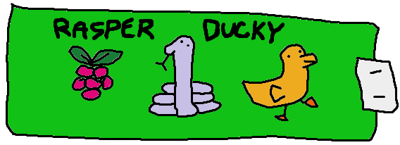

<h1 align="center">
  RasperDucky
</h1>

<p align="center">
  <strong>An open-source implementation of DuckyScript3 with CircuitPython for Raspberry Pi Pico</strong>
</p>

<div align="center">
  
</div>

<div align="center">
  
  
</div>

This project aims to provide an open-source implementation of DuckyScript3, a scripting language used for automating tasks on USB Rubber Ducky devices. Its goal is to achieve a 1-to-1 implementation of DuckyScript3 targeting a Raspberry Pi Pico and Raspberry Pi Pico 2.

## Getting Started

### Installation on Raspberry Pi Pico 2
#### Install CircuitPython 9.2.0
- Go to the [CircuitPython website](https://circuitpython.org/board/raspberry_pi_pico/) and download the `CircuitPython 9.2.0` firmware for Raspberry Pi Pico 2 using the "DOWNLOAD .UF2 NOW" button.
<p align="center">
  
</p>

- Hold the BOOTSEL button on your Raspberry Pi Pico 2 and connect it to your computer using a USB cable. Once `RPI-RP2` appears in the device manager, release the BOOTSEL button.
<p align="center">
  
</p>

- Open your `RPI-RP2` drive and drag and drop the downloaded `.UF2` file to the Raspberry Pi Pico 2.
<p align="center">
  
</p>

- Once the Raspberry Pi Pico is restarted, it will appear as `CIRCUITPY` in the device manager.

#### Install the rasper-ducky library
- Connect your Raspberry Pi Pico to your computer and copy/paste the content of the `rasper_ducky` folder to the `CIRCUITPY` drive.
- Create a new file named `payload.dd` at the root of the `CIRCUITPY` drive containing your DuckyScript3 script.
<p align="center">
  
</p>

- You can try it out with this simple script, which will open a PowerShell window and print "Hello, World!" 3 times, separated by a space:
```plaintext
DEFINE #COUNT 3

FUNCTION open_powershell()
    GUI R
    STRINGLN powershell
END_FUNCTION

FUNCTION hello_world()
    $x = 0
    WHILE ($x < #COUNT)
        DELAY 500
        STRING Hello, World!
        SPACE
        $x = $x + 1
    END_WHILE
END_FUNCTION

open_powershell()
DELAY 1000
hello_world()
```
<p align="center">
  
</p>


## Debugging

To debug the script, connect to the Raspberry Pi Pico 2 using Putty or similar and use the serial console. I've seen ports up to COM8 on my computer so try them all until you find the correct one.
Once connected, you should see the output of the script in the serial console.


## Disclaimer
I am not affiliated with Hak5 or USB Rubber Ducky in any way. This is a side project and I do it for fun. 

There are some choices in the DuckyScript3 language that I dislike and may want to change in the future, maybe in a fork of this project. For example, in DuckyScript3 :
- Functions do not take parameters and can't return values
- Every variable is a global variable, no scoping is implemented, variables declared in functions will bleed into the global scope
- No mathematical operator precedence, requiring parenthesis for simple expressions (10 + 2 * 3 will be interpreted as (10 + 2) * 3)
- Variables can only be integers
- DELAY, STRING and STRINGLN don't accept variables
- No for loops, only WHILE loops are supported
- Need to declare variables before using them

## Features
- **Raspberry Pi Pico Support**: Execute scripts on a Raspberry Pi Pico.
- **Full test suite**: Ensure the implementation is correct and reliable.
- **Open Source**: Contribute to the project and help me improve the implementation, please refer to the [CONTRIBUTING.md](CONTRIBUTING.md) file.
- **Partial DuckyScript3 Syntax Support**: Parse and execute scripts written in DuckyScript3, including standard commands and syntax.
  - **Conditional Statements**: `IF`, `ELSE IF`, `ELSE`
  - **Comments**: `REM`, `REM_BLOCK`
  - **Variables**: `VAR $x = 10`
  - **Loops**: `WHILE ($x < 10)`
  - **Functions**: `FUNCTION hello_world()`
  - **Defines**: `DEFINE #COUNT 3`
  - **Operators**: `$x = (-12 + 34) * 10 / 2`
  - **Keywords**: `TRUE`, `FALSE`, `DELAY 1000`, `STRING Hello, World!`, `STRINGLN Hello, World!`
  - **Keys and shortcuts**: `GUI R`, `SPACE`, `CTRL ALT DEL`, `BACKSPACE`, `ALT TAB`, `ESC`, etc.
  - **Comparison operators**: `==`, `!=`, `>`, `>=`, `<`, `<=`
  - **Unary operators**: `-$x`, `!($x > 10)`
- **Additional features (not included in DuckyScript3 but nice to have)**:
  - **Keyboard layouts**: `RD_KBD WIN FR` for French keyboard on Windows, `RD_KBD MAC UK` for UK keyboard on Mac, etc.
  - **Operators precedence**: `10 + 2 * 3 / 4` will be interpreted as `10 + ((2 * 3) / 4)`
  - **No need for VAR**: No need to declare variables before using them, just use them directly : `$x = 10` is equivalent to `VAR $x = 10`


## Roadmap

- [ ] Complete the roadmap
- [ ] Complete 1-to-1 DuckyScript3 implementation
  - [ ] `WAIT_FOR_BUTTON_PRESS`
  - [ ] `BUTTON_DEF`
  - [ ] `LED_R` / `LED_G` (only one green led on the Raspberry Pi Pico 2)
  - [ ] `RANDOM_LOWERCASE_LETTER`, `RANDOM_UPPERCASE_LETTER`, `RANDOM_LETTER`, `RANDOM_NUMBER`, `RANDOM_CHAR`
  - [ ] `HOLD` / `RELEASE`
  - [ ] `RESTART_PAYLOAD` / `STOP_PAYLOAD`
- [ ] Improve error handling and debugging features


## Thanks

- Thanks to [@hak5](https://github.com/hak5) for the original DuckyScript language.
- Thanks to [@munificent](https://github.com/munificent) for the crafting interpreters web book, which was a great help to understand how to implement a scripting language.
- Thanks to [@dbisu](https://github.com/dbisu) for [Pico-Ducky](https://github.com/dbisu/pico-ducky), which was the starting point for this project.
- Thanks to the Team behind [CircuitPython](https://github.com/adafruit/circuitpython) for the amazing work on this firmware and their support.
- Thanks to the rest of the community for making this fun little project possible (AdaFruit, MicroPython, etc.).
